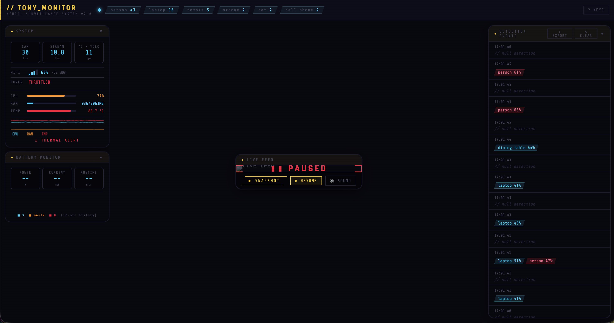

# Project: <your project name>

**Student:** <Ramon Naula>
**Camera used:** Tony
**One-line pitch:** <Tony is a classroom agent, that interacst with the class in general to create a more supportive enviroment for both students and educators>

---

## What I tried

Two or three sentences. No code. Describe the idea and the approach a non-engineer would understand.

> I wanted to created a interactive bot that responds back to student moods that seem confused, open to questions or even bored. Tony could have been an app or just pure sofware but that break the experience we want to share with Tony. The point is not to make the user be part of tony but for tony to be part of You!.

## What worked

Two or three bullet points. Be specific — "detected a person 3 meters away reliably" is better than "it worked."

-Camara object detection (Yolo)
-Camera life feed and system monitor to check on tony's health

## What broke

Two or three bullet points. **Be honest.** False positives, weird edge cases, things you'd warn the next student about. This is the most valuable section of your retro — don't skip it.

-It swapped reds for blues idk why but it was a pain to fix(is fixed now)
-Yolo is still a little funcky but it works well as a base structure
-The monitoring system scares me cause tony is constantly at 84 F

## One screenshot

Put your screenshot in `docs/whitepaper/artifacts/` using the naming convention `<firstname>-<project>-screenshot.png`, then link to it here:

Caption: Tony's Health

## If I had another week

The next move is to litterally make tony move. Tony can see ti would be nice if it can make the first steps into integrating into a student classroom

---

*Submission checklist:*
- [ ] File named `<firstname>-<project>-retro.md` and placed in `docs/whitepaper/retros/`
- [ ] Screenshot added to `docs/whitepaper/artifacts/` and linked above
- [ ] "What broke" section is honest and specific
- [ ] No code snippets — this is a story, not a tutorial
- [ ] Opened as a pull request, not pushed to `main`
